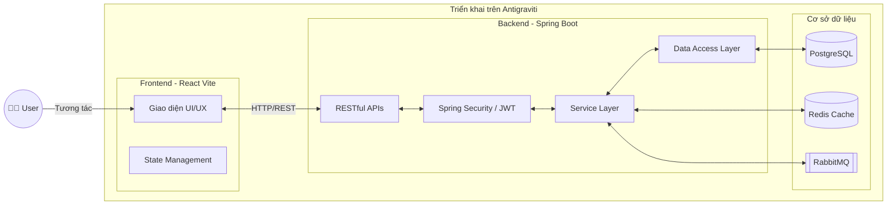

<div align="center">

# 🎓 Hệ thống Quản lý Thực tập sinh (Internship Management System)

[](#)
[](#)
[](#)
[](#)

*Một hệ thống quản lý thực tập toàn diện, giúp kết nối Nhà trường, Doanh nghiệp, Cố vấn (Mentor) và Thực tập sinh (Student) trong một nền tảng duy nhất, tối ưu hóa quy trình đánh giá và theo dõi tiến độ.*

</div>

---

## 🏛 Kiến trúc Hệ thống (Architecture)



---

## ✨ Tính năng nổi bật

- ✅ **Quản lý phân quyền chặt chẽ:** Hỗ trợ đa dạng vai trò (Admin, Mentor, Student, Doanh nghiệp) với các quyền hạn chuyên biệt.
- ✅ **Giao diện hiện đại (UI/UX):** Xây dựng bằng React và Material UI, cho trải nghiệm mượt mà, phản hồi nhanh chóng và hỗ trợ Responsive tốt.
- ✅ **Quản lý hồ sơ linh hoạt:** Quản lý thông tin Học sinh và Cố vấn với các thông tin đặc thù (Mã sinh viên, Phòng ban, Cấp bậc...).
- ✅ **Theo dõi tiến độ thực tập:** Cho phép Mentor đánh giá, sinh viên nộp báo cáo, nhà trường kiểm soát quá trình qua từng giai đoạn (Phase/Round).
- ✅ **Hiệu năng cao & Mở rộng tốt:** Tích hợp Redis để caching, RabbitMQ để xử lý tác vụ bất đồng bộ (ví dụ: gửi email thông báo).

---

## 📂 Cấu trúc thư mục (Folder Structure)

```text
Internship-Management/
├── Frontend/                      # Nơi chứa mã nguồn giao diện (React + Vite)
│   ├── public/                    # Tài nguyên tĩnh (ảnh, icon...)
│   ├── src/                       
│   │   ├── api/                   # Các cấu hình gọi gọi API (axios)
│   │   ├── components/            # Các UI component dùng chung
│   │   ├── pages/                 # Các trang giao diện chính (UsersManagement...)
│   │   └── ...                    
│   ├── package.json               # Quản lý thư viện Node.js
│   └── vite.config.js             # Cấu hình Vite
│
└── Backend/                       # Nơi chứa mã nguồn máy chủ (Spring Boot)
    ├── src/main/java/pka/edu/     
    │   ├── config/                # Cấu hình hệ thống (CORS, Swagger...)
    │   ├── controller/            # Tiếp nhận request REST API (UserController...)
    │   ├── dto/                   # Đối tượng truyền tải dữ liệu (Request/Response)
    │   ├── entity/                # Định nghĩa các thực thể (User, Student, Mentor...)
    │   ├── repository/            # Giao tiếp với Database (JPA)
    │   ├── security/              # Cấu hình bảo mật, phân quyền (JWT)
    │   └── service/               # Xử lý logic nghiệp vụ chính
    ├── docker-compose.yml         # Cấu hình khởi chạy các service (Postgres, Redis, MQ)
    ├── Dockerfile                 # Cấu hình đóng gói Backend
    └── build.gradle               # Quản lý thư viện Java (Gradle)
```

---

## 🚀 Hướng dẫn cài đặt & Chạy Local

### Bước 1: Khởi động Database & Cache bằng Docker
Di chuyển vào thư mục Backend và khởi chạy các service nền tảng bằng Docker Compose:
```bash
cd Backend
docker-compose up -d postgres redis rabbitmq
```

### Bước 2: Chạy Backend (Spring Boot)
Bạn có thể chạy Backend trực tiếp thông qua Docker hoặc bằng Gradle:

**Cách 1 (Bằng Docker):**
```bash
docker-compose up -d --build backend
```

**Cách 2 (Bằng Gradle Local):**
```bash
./gradlew bootRun
```
*Backend sẽ khởi chạy tại: `http://localhost:8080`*

### Bước 3: Chạy Frontend (React Vite)
Mở một Terminal mới, di chuyển vào thư mục Frontend, cài đặt thư viện và chạy:
```bash
cd Frontend
npm install
npm run dev
```
*Frontend sẽ khởi chạy tại: `http://localhost:5173` (hoặc cổng cấu hình trong Vite)*

---

## ⚙️ Cấu hình Môi trường (Environment Variables)

Bạn cần thiết lập các biến môi trường tại Backend (trong `application.yml`, `.env` hoặc file cấu hình hệ thống).

| Tên biến | Mô tả | Ví dụ |
| :--- | :--- | :--- |
| `SPRING_DATASOURCE_URL` | URL kết nối đến cơ sở dữ liệu PostgreSQL | `jdbc:postgresql://localhost:5432/internship_db` |
| `SPRING_DATASOURCE_USERNAME` | Tên đăng nhập PostgreSQL | `postgres` |
| `SPRING_DATASOURCE_PASSWORD` | Mật khẩu PostgreSQL | `123456` |
| `SPRING_DATA_REDIS_HOST` | Host của Redis Cache | `localhost` |
| `SPRING_RABBITMQ_HOST` | Host của RabbitMQ | `localhost` |
| `JWT_SECRET` | Khóa bí mật để ký JWT Token | `very_secret_key_123456...` |

---

## ☁️ Triển khai trên Antigraviti

Để đưa dự án này lên chạy chính thức trên môi trường **Antigraviti**, bạn hãy thực hiện theo quy trình sau:

1. **Chuẩn bị file cấu hình:** 
   Đảm bảo `Dockerfile` và `docker-compose.yml` (nếu có dùng Antigraviti Docker Engine) đã thiết lập chuẩn xác. Frontend cần có `Dockerfile` riêng dựa trên Nginx để serve file tĩnh sau khi build (`npm run build`).
2. **Khai báo Services:** 
   Truy cập vào Dashboard của Antigraviti, tạo một Project mới. Khai báo các Database Container (Postgres, Redis, RabbitMQ) bằng hệ sinh thái có sẵn của Antigraviti.
3. **Cấu hình Biến môi trường:** 
   Vào mục Environment Variables của Project trên Antigraviti, nhập các thông số kết nối Database nội bộ mà nền tảng vừa cấp cho bạn.
4. **Deploy:** 
   Liên kết Repository Github của dự án với Antigraviti. Nhấn nút **Deploy**. Antigraviti sẽ tự động build image và quản lý luồng CI/CD, tự động cung cấp SSL và tên miền (domain) cho Frontend và Backend của bạn.

---

## 📖 Tài liệu API (API Reference)

Dưới đây là ví dụ một số API quan trọng trong hệ thống:

| Method | Endpoint | Description | Vai trò (Role) |
| :--- | :--- | :--- | :--- |
| `POST` | `/api/v1/users` | Tạo tài khoản mới (Gồm cả cấu hình thông tin Student/Mentor) | `ADMIN` |
| `PUT` | `/api/v1/users/{id}` | Cập nhật hồ sơ tài khoản | `ADMIN`, `STUDENT`, `MENTOR` |
| `GET` | `/api/v1/users/profiles` | Lấy danh sách toàn bộ người dùng có phân trang | `ADMIN` |

