# Tổng hợp Biểu đồ Use Case Phân rã bằng Mermaid (Từ 3.3.5 đến 3.3.16)

Dưới đây là mã nguồn Mermaid cho tất cả các biểu đồ Use Case phân rã. Bạn có thể xem trước nội dung này bằng cách render file trên GitHub hoặc copy dán vào [Mermaid Live Editor](https://mermaid.live/).

## 3.3.5 Quản lý hồ sơ cá nhân
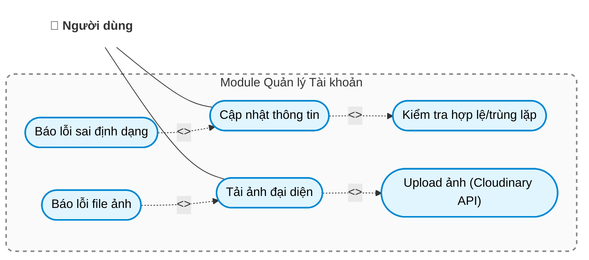

## 3.3.6 Quản lý tài khoản người dùng
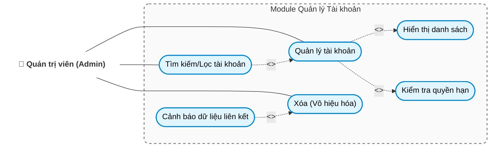

## 3.3.7 Dashboard & Thống kê
```mermaid
flowchart LR
    User["👤 Người dùng chung"]:::actor
    Admin["👤 Admin"]:::actor
    GV["👤 Giáo viên"]:::actor

    subgraph System["Hệ thống Quản lý Thực tập"]
        direction TB
        UC_Dash(["Dashboard & Thống kê"]):::uc
        UC_Role(["Nhận diện vai trò"]):::uc
        UC_StatAdmin(["Xem thống kê tổng"]):::uc
        UC_StatGV(["Xem tiến độ"]):::uc
        UC_Export(["Xuất báo cáo thống kê"]):::uc
    end

    User --- UC_Dash
    Admin --- UC_StatAdmin
    GV --- UC_StatGV

    UC_Dash -. "<<include>>" .-> UC_Role
    UC_StatAdmin -. "<<extend>>" .-> UC_Dash
    UC_StatGV -. "<<extend>>" .-> UC_Dash
    UC_Export -. "<<extend>>" .-> UC_StatAdmin

    classDef actor fill:transparent,stroke:none,font-size:16px,font-weight:bold;
    classDef uc fill:#e1f5fe,stroke:#0288d1,stroke-width:2px,color:#000,rx:20,ry:20;
    style System fill:#fafafa,stroke:#888,stroke-width:2px,stroke-dasharray: 5 5, rx:10;
```

## 3.3.8 Quản lý trường đại học
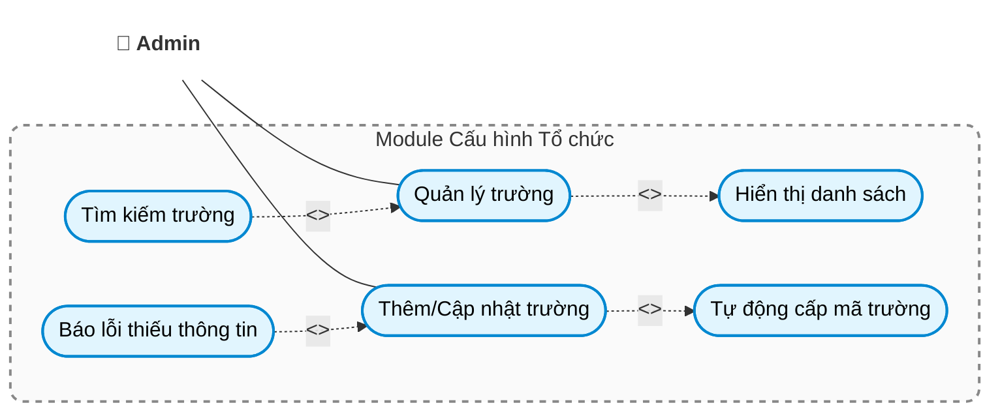

## 3.3.9 Quản lý công ty
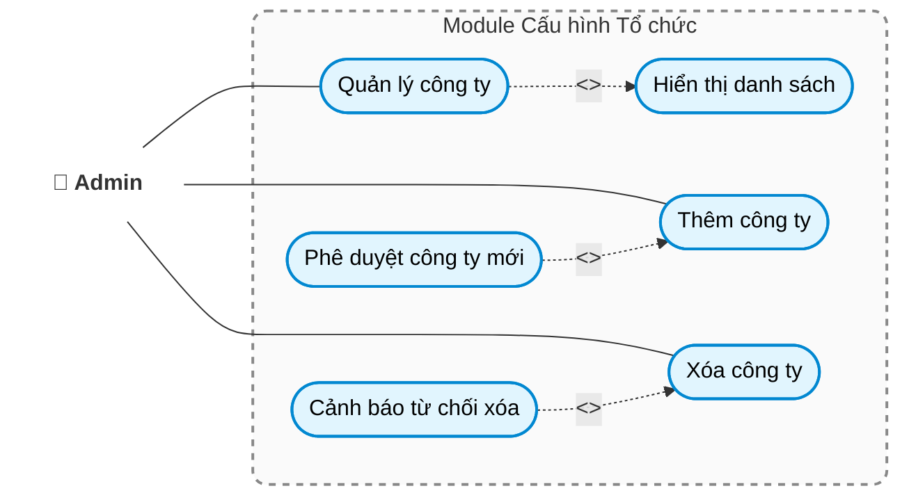

## 3.3.10 Quản lý nhân sự tổ chức
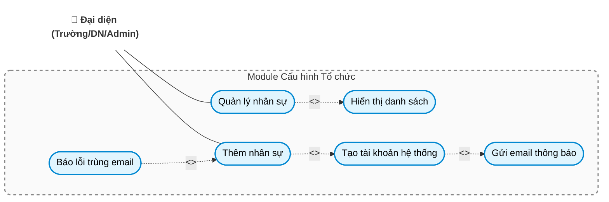

## 3.3.11 Quản lý lớp thực tập
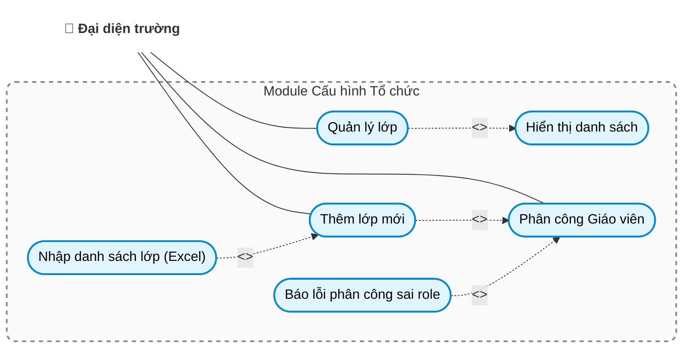

## 3.3.12 Quản lý gia nhập trường học
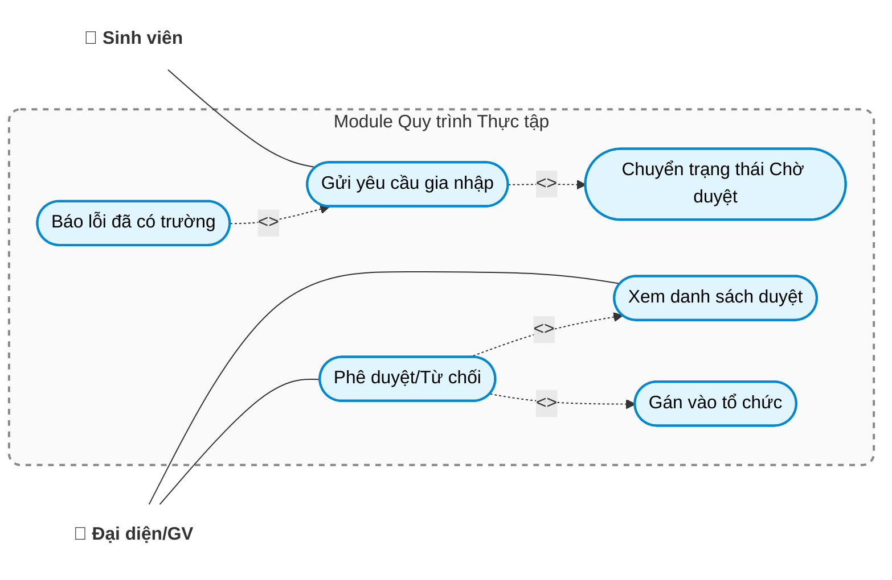

## 3.3.13 Quản lý gia nhập công ty
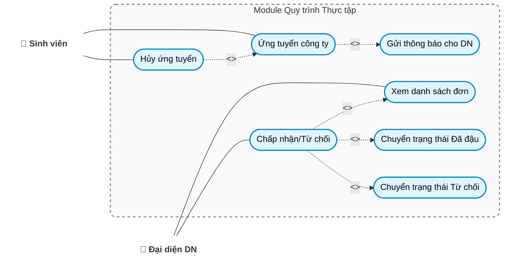

## 3.3.14 Phân công cố vấn thực tập
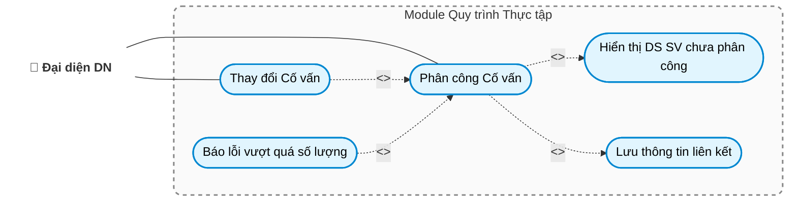

## 3.3.15 Quản lý báo cáo định kỳ
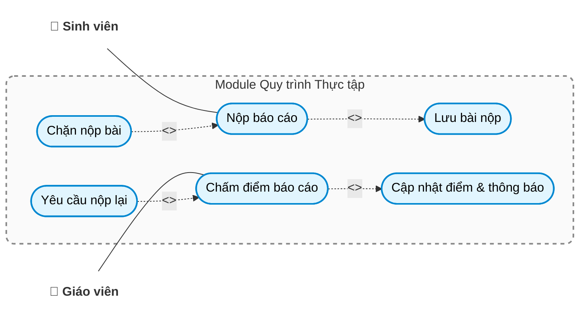

## 3.3.16 Quản lý báo cáo cuối kỳ
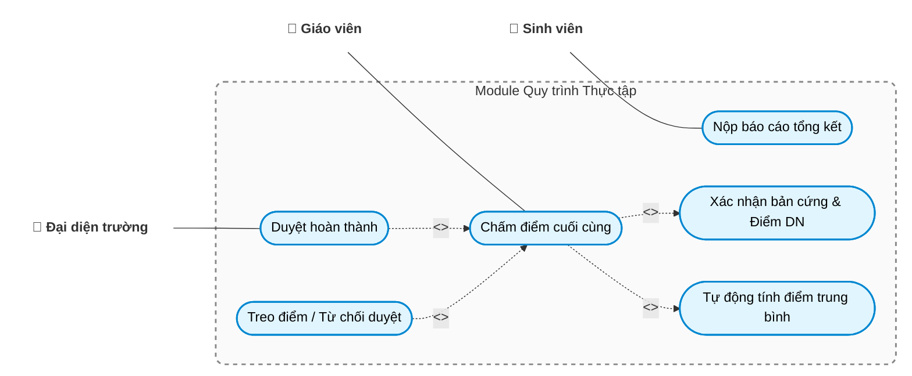
